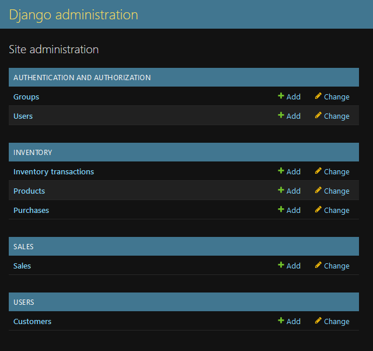
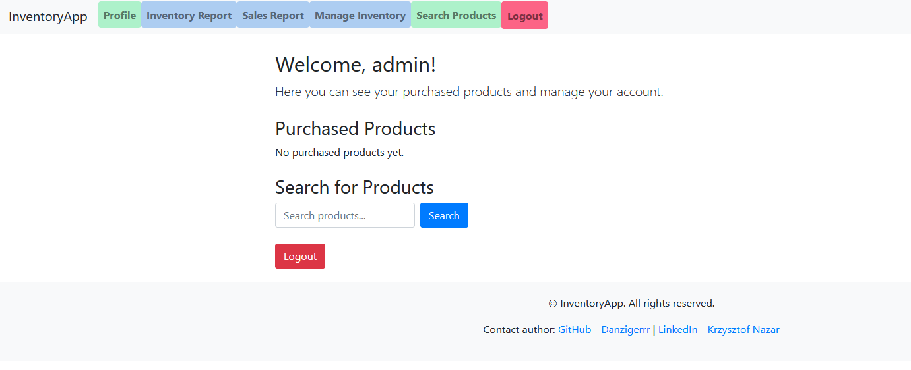
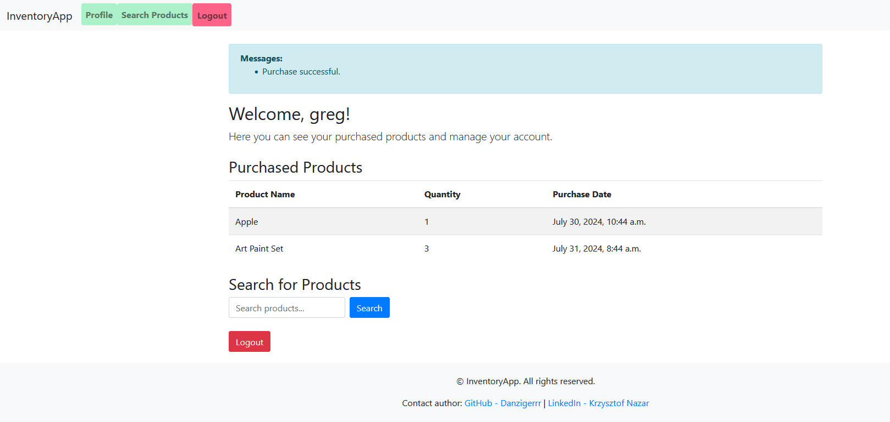
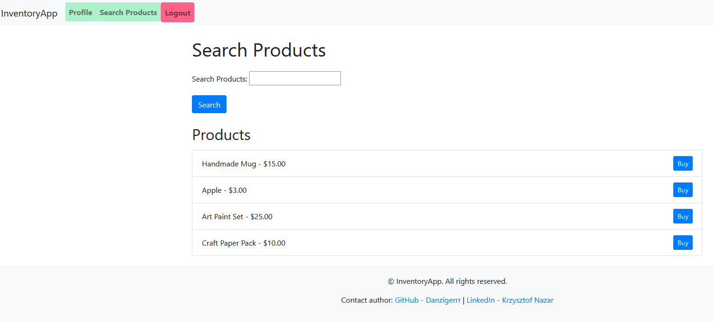
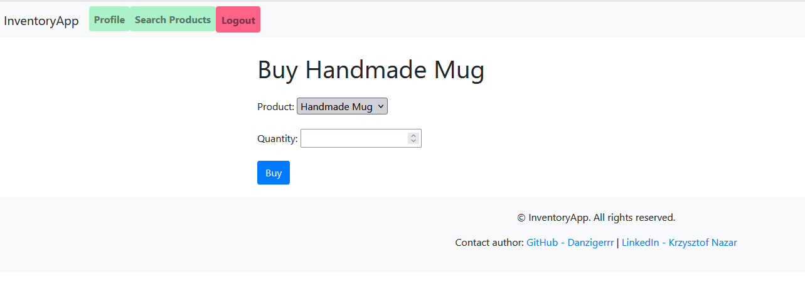
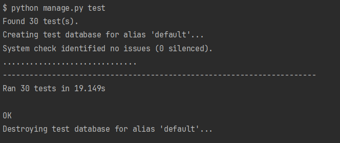

<p align="center">
  <a href="https://www.google.com/url?sa=i&url=https%3A%2F%2Fwww.freepik.com%2Fpremium-vector%2Fweather-infographic-line-climate-forecast-banner-with-rain-sunny-cold-day-elements-clouds-sky-moon-icons-precipitation-cloudiness-prediction-vector-meteorology-background_33099939.htm&psig=AOvVaw2MkwMPrTj5Qa60n1F8LWEi&ust=1721297430172000&source=images&cd=vfe&opi=89978449&ved=0CBEQjRxqFwoTCMjzn-HqrYcDFQAAAAAdAAAAABAE" 
target="blank"></a>
</p>

# Inventory and Sales Management System

This is a Django-based web application designed to manage the inventory and sales for a small business that sells handmade crafts and art supplies. The application provides functionalities to track inventory levels, process sales, and generate reports.

## Features

- **Inventory Management**: Track stock levels, receive new inventory, and update inventory levels as items are sold.
- **Sales Processing**: Process sales in both the physical store and the online store, and automatically update inventory levels accordingly.
- **Reporting**: Generate reports on sales, inventory levels, and customer data, such as popular products and customer purchase histories.
- **User-Friendly Interface**: Easy-to-use interface for the business owner and employees.
- **Security**: Password-protected access and regular data backups.
- **Scalability**: Designed to accommodate future business growth.

## Installation

1. **Clone the Repository**
   ```bash
   git clone https://github.com/Danzigerrr/Inventory-Management-System-using-Django.git
   cd inventory_management
   ```

2. **Create and Activate a Virtual Environment**
   ```bash
   python -m venv venv
   source source .venv/Scripts/activate

   ```

3. **Install Dependencies**
   ```bash
   pip install -r requirements.txt
   ```

4. **Run Migrations**
   ```bash
   python manage.py migrate
   ```

5. **Insert sample data into database**
   ```bash
   python manage.py populate_db
   ```
   
6. **Create a Superuser**
   ```bash
   python manage.py createsuperuser
   ```

7. **Run the Development Server**
   ```bash
   python manage.py runserver
   ```

8. **Access the Application**
    - Open your browser and go to `http://127.0.0.1:8000/`

## Usage

### Admin Interface

- Visit `http://127.0.0.1:8000/admin/` to access the Django admin interface.
- Log in with the superuser credentials.
- Manage products, inventory transactions, sales, and customer data through the admin interface.

<p align="center">
  <a href="https://www.google.com/url?sa=i&url=https%3A%2F%2Fwww.freepik.com%2Fpremium-vector%2Fweather-infographic-line-climate-forecast-banner-with-rain-sunny-cold-day-elements-clouds-sky-moon-icons-precipitation-cloudiness-prediction-vector-meteorology-background_33099939.htm&psig=AOvVaw2MkwMPrTj5Qa60n1F8LWEi&ust=1721297430172000&source=images&cd=vfe&opi=89978449&ved=0CBEQjRxqFwoTCMjzn-HqrYcDFQAAAAAdAAAAABAE" 
target="blank"></a>
</p>

The admin can also log in to the system and manage the inventory, sales, and customer data through the provided interface.

<p align="center">
  <a href="https://www.google.com/url?sa=i&url=https%3A%2F%2Fwww.freepik.com%2Fpremium-vector%2Fweather-infographic-line-climate-forecast-banner-with-rain-sunny-cold-day-elements-clouds-sky-moon-icons-precipitation-cloudiness-prediction-vector-meteorology-background_33099939.htm&psig=AOvVaw2MkwMPrTj5Qa60n1F8LWEi&ust=1721297430172000&source=images&cd=vfe&opi=89978449&ved=0CBEQjRxqFwoTCMjzn-HqrYcDFQAAAAAdAAAAABAE" 
target="blank"></a>
</p>


### Main Application for Users

- **Searching products**: Navigate to `/inventory/search/` to search for products by name.

<p align="center">
  <a href="https://www.google.com/url?sa=i&url=https%3A%2F%2Fwww.freepik.com%2Fpremium-vector%2Fweather-infographic-line-climate-forecast-banner-with-rain-sunny-cold-day-elements-clouds-sky-moon-icons-precipitation-cloudiness-prediction-vector-meteorology-background_33099939.htm&psig=AOvVaw2MkwMPrTj5Qa60n1F8LWEi&ust=1721297430172000&source=images&cd=vfe&opi=89978449&ved=0CBEQjRxqFwoTCMjzn-HqrYcDFQAAAAAdAAAAABAE" 
target="blank"></a>
</p>

- **Purchase Products**: Selected a product to buy it and specify the quantity.

<p align="center">
  <a href="https://www.google.com/url?sa=i&url=https%3A%2F%2Fwww.freepik.com%2Fpremium-vector%2Fweather-infographic-line-climate-forecast-banner-with-rain-sunny-cold-day-elements-clouds-sky-moon-icons-precipitation-cloudiness-prediction-vector-meteorology-background_33099939.htm&psig=AOvVaw2MkwMPrTj5Qa60n1F8LWEi&ust=1721297430172000&source=images&cd=vfe&opi=89978449&ved=0CBEQjRxqFwoTCMjzn-HqrYcDFQAAAAAdAAAAABAE" 
target="blank"></a>
</p>

- **Check Purchased Products**: Navigate to `/users/profile/` to view profile details and purchasing history.

<p align="center">
  <a href="https://www.google.com/url?sa=i&url=https%3A%2F%2Fwww.freepik.com%2Fpremium-vector%2Fweather-infographic-line-climate-forecast-banner-with-rain-sunny-cold-day-elements-clouds-sky-moon-icons-precipitation-cloudiness-prediction-vector-meteorology-background_33099939.htm&psig=AOvVaw2MkwMPrTj5Qa60n1F8LWEi&ust=1721297430172000&source=images&cd=vfe&opi=89978449&ved=0CBEQjRxqFwoTCMjzn-HqrYcDFQAAAAAdAAAAABAE" 
target="blank"></a>
</p>

## Testing
To run the tests use the following command:
```bash
python manage.py test
```
<p align="center">
  <a href="https://www.google.com/url?sa=i&url=https%3A%2F%2Fwww.freepik.com%2Fpremium-vector%2Fweather-infographic-line-climate-forecast-banner-with-rain-sunny-cold-day-elements-clouds-sky-moon-icons-precipitation-cloudiness-prediction-vector-meteorology-background_33099939.htm&psig=AOvVaw2MkwMPrTj5Qa60n1F8LWEi&ust=1721297430172000&source=images&cd=vfe&opi=89978449&ved=0CBEQjRxqFwoTCMjzn-HqrYcDFQAAAAAdAAAAABAE" 
target="blank"></a>
</p>


## Contributing

Contributions are welcome! Please fork the repository and submit a pull request.

## License

This project is licensed under the [MIT licensed](LICENSE).

## Stay in touch
**Author - Krzysztof Nazar**:
- [Linkedin](https://www.linkedin.com/in/krzysztofnazar/)
- [GitHub](https://github.com/Danzigerrr)


